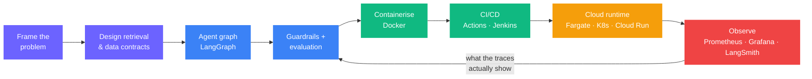

<p align="center">
  <a href="https://www.linkedin.com/in/nishant-ranjan-verma-6945648a/"></a>&nbsp;
  <a href="https://nishantrv.github.io/nishantranjanverma/"></a>&nbsp;
  <a href="https://medium.com/@nishantranjanverma"></a>&nbsp;
  <a href="mailto:nishantranjanverma@gmail.com"></a>
</p>

<br>

<h2 align="center">I build AI systems that survive contact with production.</h2>

<p align="center">
  <i>Anyone can get a model to answer in a notebook.<br>
  The work is everything after that — grounding it, guarding it,<br>
  proving it, shipping it, and keeping it standing under load.</i>
</p>

<p align="center">
  <b>Senior AI Data Scientist</b> @ <b>Solventum</b> &nbsp;·&nbsp; Dublin, Ireland &nbsp;·&nbsp; since March 2026
</p>

<p align="center">
  
  
  
  
  
</p>

---

## Toolkit

<details open>
<summary><b>🧠 AI &amp; GenAI</b></summary>
<br>


</details>

<details open>
<summary><b>🔬 ML &amp; Deep Learning</b></summary>
<br>


</details>

<details open>
<summary><b>🚀 MLOps &amp; DevOps</b></summary>
<br>


</details>

<details open>
<summary><b>☁️ Cloud &amp; Data</b></summary>
<br>


</details>

---

## Track record

```
  2026 ──── 🟣  Senior AI Data Scientist ───── Solventum · Dublin, Ireland
    now      │   AI & data science for healthcare technology
             │
  2024-25 ── 🔵  Lead AI & Data Engineer ───── Virgin Media · Ireland
             │   GenAI solutions for 5M+ customers across UK & Ireland
             │
  2022 ───── 🟢  Sr. ML Engineer / MLOps ───── Wayfair · Ireland
             │   ML models for a $12B+ e-commerce platform
             │
  2022 ───── 🟡  Data Scientist ────────────── Habitus Health · Ireland
             │   Predictive models for healthcare compliance
             │
  2018 ───── 🟠  Data Analyst & Consultant ─── Adobe Systems · India
             │   Analytics for 50+ Fortune 500 clients
             │
  2016 ───── 🔴  Analyst ───────────────────── Google · India
                 Data analysis for advertising & search products
```

**Education** &nbsp;·&nbsp; 🎓 MSc AI & Big Data, *Distinction* — ATU, Ireland &nbsp;·&nbsp; 🎓 BE Computer Science Engineering — Amity University, India

---

## Selected work

Three systems, each solving a problem that only shows up once you try to run the thing for real.

<br>

### `01` &nbsp; Production Multi-Agent RAG

> **Enterprise document Q&A where a confidently wrong answer is worse than no answer.**

|  |  |
|---|---|
| **Problem** | Retrieval over a mixed corpus returns plausible-looking noise. Off-topic and jailbreak prompts reach the model. Nothing proves the answer was grounded. |
| **Approach** | A LangGraph agent graph — planner, retriever, responder — behind a NeMo Guardrails gate that blocks inputs *before* any retrieval spend. Qdrant vector search, Jina reranking to separate signal from noise, Portkey gateway for automatic OpenAI → Anthropic failover, and a RAGAS eval suite so quality is measured rather than asserted. |
| **Shipped** | AWS ECS Fargate across two AZs behind an ALB, auto-scaling 2→10 tasks on request count and CPU. Secrets in Secrets Manager, state in managed Qdrant/Neon/Upstash so every task stays stateless. GitHub Actions builds to ECR and rolls the service. Prometheus, Logfire and LangSmith on every node. |

`LangGraph` `NeMo Guardrails` `Portkey` `Qdrant` `Jina` `RAGAS` `FastAPI` `AWS Fargate` `GitHub Actions`

[**Read the build →**](https://github.com/nishantrv/Production-Multi-Agentic-RAG-System-)

<br>

### `02` &nbsp; Multi-Agent Chatbot on serverless containers

> **Routing, research and analysis as separate agents — not one overloaded prompt.**

|  |  |
|---|---|
| **Problem** | A single-prompt chatbot has nowhere to put intent classification, tool use, or failure handling. Real agentic work needs a state machine, not a chain. |
| **Approach** | A LangGraph state machine with specialised nodes: a router that classifies intent, a research agent doing grounded Tavily web search, an analysis agent that reasons over the results, and a response agent that composes the answer — with conditional routing and loops between them. |
| **Shipped** | Containerised and deployed to AWS Fargate through a Jenkins pipeline (lint → test → build → ECR → deploy). Serverless containers, auto-scaling, zero server management. |

`LangGraph` `LangChain` `Tavily` `Docker` `Jenkins` `AWS ECR + Fargate`

[**Read the build →**](https://github.com/nishantrv/Multi_Agent_Chatbot-LangChain_LangGraph_AWS)

<br>

### `03` &nbsp; Agentic Product Recommender with real observability

> **Most recommender demos stop at the notebook. This one has dashboards.**

|  |  |
|---|---|
| **Problem** | Classic collaborative filtering can't answer *"a lightweight laptop for travel under €1000"*. And a recommender you can't observe is a recommender you can't operate. |
| **Approach** | Replace the user-item matrix with agents that reason in natural language — intent routing, semantic catalogue search, then LLM-generated personalised recommendations through a Flask conversational UI. |
| **Shipped** | Kubernetes deployment with pods, services, load balancing and horizontal pod autoscaling. Prometheus scrapes the app; Grafana dashboards track latency, error rate and throughput in real time. |

`LangChain` `Flask` `Kubernetes` `HPA` `Prometheus` `Grafana` `Docker`

[**Read the build →**](https://github.com/nishantrv/AgenticAI_Chatbot_Product_Recommender_System_E2E)

<br>

<details>
<summary><b>More work — agents, MLOps pipelines and deep learning</b></summary>

<br>

| Project | What it is |
|---|---|
| [**Supervisor Agent + Guardrails + HITL**](https://github.com/nishantrv/MultiAgent-System-With-GuradRails-HITL-SuperVisorAgent-LangGraph) | Supervisor-pattern multi-agent system with guardrails and a human-in-the-loop approval step |
| [**TripMate AI — MCP travel planner**](https://github.com/nishantrv/MulitAgent-With-MCPs) | Flight, hotel, itinerary and response agents coordinated by LangGraph; FastAPI + Postgres state, Groq inference |
| [**Agentic HR Copilot**](https://github.com/nishantrv/Agentic_HR_Copilot_E2E_LangGraph_Azure_LLMOPS) | End-to-end HR copilot on Azure with an LLMOps pipeline |
| [**Multi-Agent with LangSmith**](https://github.com/nishantrv/Multi-Agent-With-LangGraphs-LangSmith) | Multi-agent graphs instrumented end-to-end with LangSmith tracing |
| [**Network Security Threat Detection**](https://github.com/nishantrv/NetworkSecurity_End2End-Deployment-Docker-ECR-EC2-MLFlow-GithubAction-) | Full MLOps lifecycle for phishing/malicious-URL detection — MongoDB ETL, schema-drift validation, model factory with GridSearchCV, MLflow on DagsHub, GitHub Actions → ECR → EC2 |
| [**RAG Medical Chatbot**](https://github.com/nishantrv/RAG_Medical_ChatBot) | Retrieval-augmented assistant over medical literature |
| [**Chest Disease Classification**](https://github.com/nishantrv/Chest-Disease-Classification--MLFlow-DVC-MLOps-Deployment-) | VGG16 transfer learning for medical imaging, versioned with DVC and tracked in MLflow |
| [**US Visa Approval Prediction**](https://github.com/nishantrv/US-Visa-Approval-Prediction-MLOPS-E2E) | End-to-end MLOps classification pipeline with automated training and deployment |
| [**ML Recommender on GCP**](https://github.com/nishantrv/ML-Recommender-System_End2End_-Jenkins-Docker-GCP-Flask-MLFlow-CloudRun-) | Jenkins → Docker → Cloud Run, with MLflow experiment tracking |
| [**PDF QA Engine**](https://github.com/nishantrv/PDF-QA-Engine-Langchain-OpenAI-FastAPI-) | Document question-answering service on LangChain + FastAPI |

</details>

---

## How I build

The same loop, whatever the problem is. The parts on the right are the ones that decide whether it survives.



**Three rules I keep coming back to**

- **Verify, don't trust.** If a model claims something, something deterministic should be able to check it.
- **Block early.** Guardrails belong in front of retrieval, not in front of the response — it's cheaper and safer.
- **Ship it stateless.** State goes in managed services so the compute layer can scale without carrying opinions.

---

## What I work on

<table>
<tr>
<td width="33%" valign="top">

**🤖 Agentic AI**

Multi-agent systems with LangGraph and LangChain that route, reason, call tools and recover from failure.

</td>
<td width="33%" valign="top">

**🔍 RAG Systems**

Grounded retrieval with vector search, reranking and evidence verification — answers that cite something real.

</td>
<td width="33%" valign="top">

**⚙️ MLOps**

CI/CD, Docker, Kubernetes, MLflow and DVC. The pipeline between a trained model and a running one.

</td>
</tr>
<tr>
<td width="33%" valign="top">

**🧠 ML Applications**

Classification, regression and recommender systems built for production serving, not leaderboard scores.

</td>
<td width="33%" valign="top">

**🏥 Deep Learning**

CNNs and transfer learning for medical imaging and computer vision.

</td>
<td width="33%" valign="top">

**☁️ Cloud Deployment**

AWS (Fargate, ECS, ECR, EC2, S3), GCP Cloud Run, Azure, Kubernetes — with the monitoring attached.

</td>
</tr>
</table>

---

## Ask me about

<p align="center">
  
  
  <br>
  
  
  <br>
  
  
</p>

<p align="center">
  <i>Open to conversations about agentic AI, applied ML in healthcare, and anything involving the word “production”.</i>
</p>

---

## Activity

<p align="center">
  
  
</p>

<p align="center">
  
</p>

<p align="center">
  <picture>
    <source media="(prefers-color-scheme: dark)" srcset="https://raw.githubusercontent.com/platane/snk/output/github-contribution-grid-snake-dark.svg" />
    <source media="(prefers-color-scheme: light)" srcset="https://raw.githubusercontent.com/platane/snk/output/github-contribution-grid-snake.svg" />
    
  </picture>
</p>

<p align="center">
  
</p>


